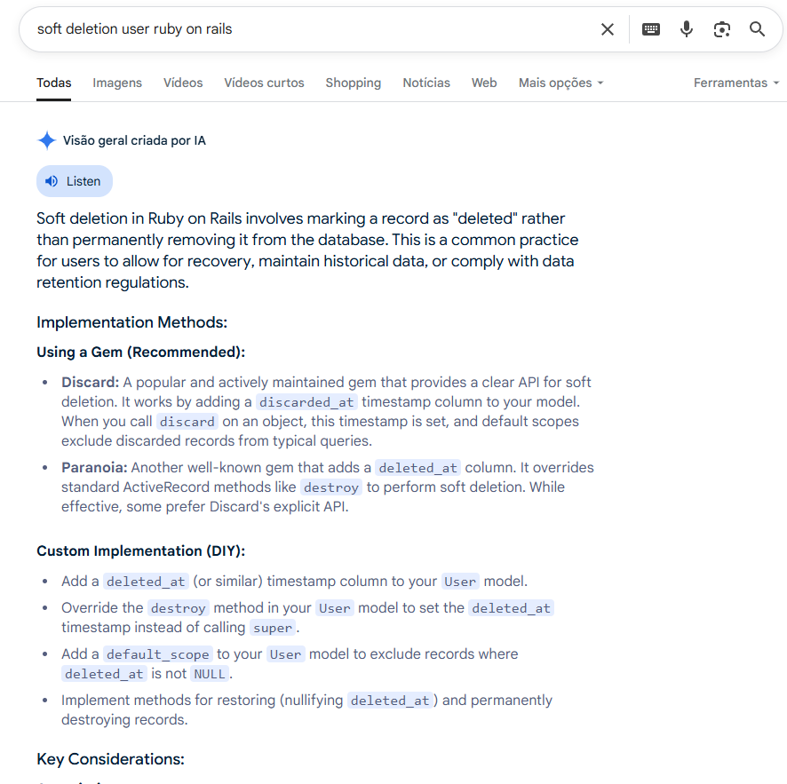
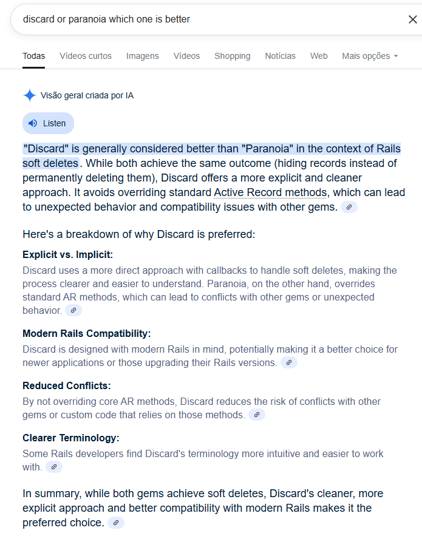
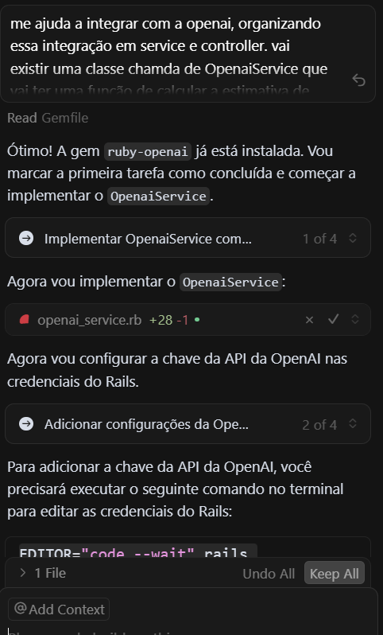
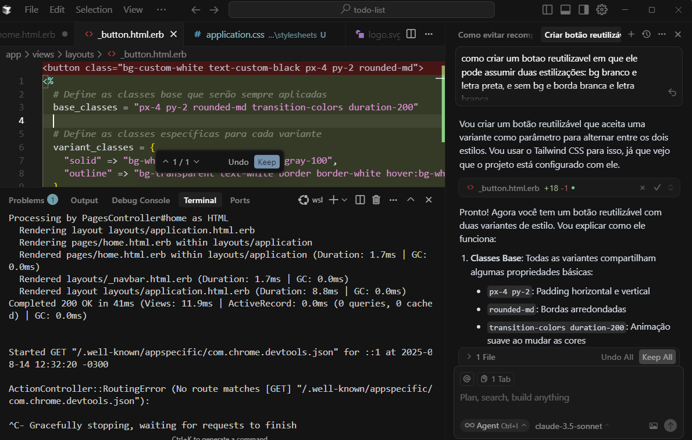
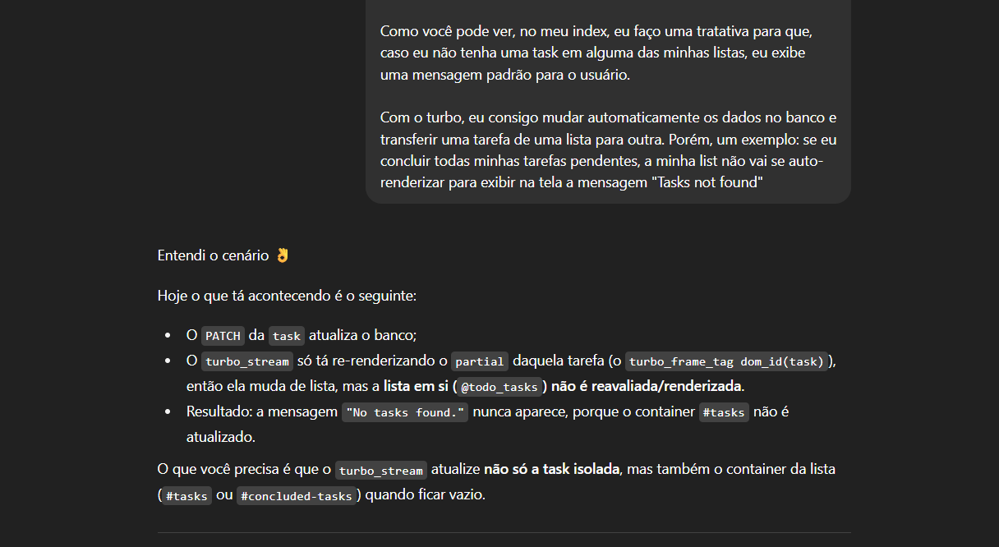
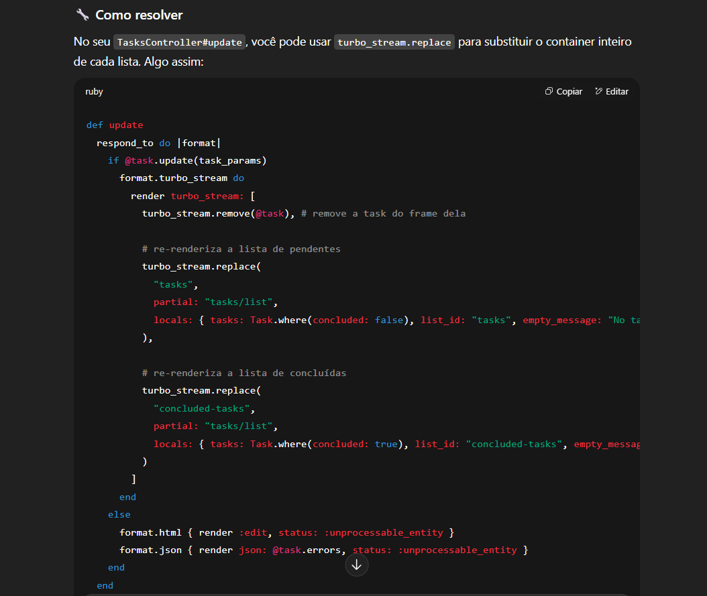
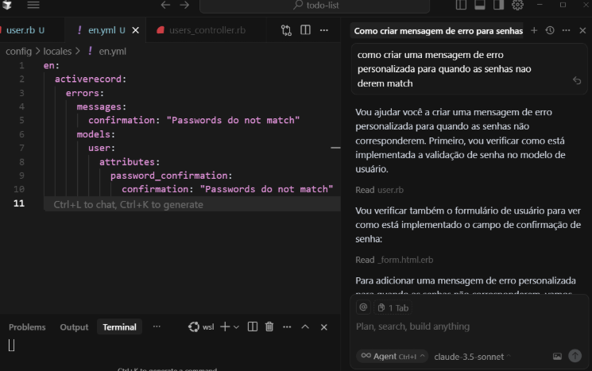

# AI-Powered Task Management

DODO is a modern web application for task management that uses AI to estimate task completion times. Built with Ruby on Rails and JavaScript, it provides a seamless and intuitive user experience for managing your daily tasks.

## 🔗 Live Demo

Visit [https://todo-list-ewry.onrender.com](https://todo-list-ewry.onrender.com) to see DODO in action.

## Features

- **Task Management**
  - Create, edit, and delete tasks
  - Mark tasks as complete/incomplete
  - Set due dates
  - Add detailed descriptions
- **AI Integration**
  - Automatic time estimation for task completion using OpenAI
- **Modern UI/UX**
  - Clean and intuitive interface
  - Real-time updates using Hotwire
  - Responsive design for all devices

## Technology Stack

- **Backend**
  - Ruby on Rails 8.0.2
  - PostgreSQL
  - OpenAI API for task time estimation
- **Frontend**
  - Hotwire (Turbo + Stimulus)
  - Tailwind CSS
- **Development Tools**
  - Cursor
  - Render for deployment

### Design Decisions

**Framework Choice**

- This project represents my first experience with Ruby on Rails:
  - Embraced the challenge to learn SaludTech's primary framework
  - Demonstrated ability to quickly understand and apply new concepts
  - Showed commitment to following Rails conventions and best practices
- Applied existing programming knowledge to new technologies:
  - Successfully implemented AI integration
  - Built a complete CRUD application with authentication
  - Used modern Rails features:
    - Learned and implemented Stimulus controllers for interactivity
    - Used Turbo for dynamic page updates

## 🤖 AI Usage in Development

### Research and Technical Decisions with AI

1. **Rails Best Practices Research**

   - Used AI to research and understand Rails conventions and best practices
   - Investigated optimal approaches for common patterns in Rails applications

   **Soft Delete Implementation:**

   - Researched different soft delete approaches available in Rails
   - Used AI to understand pros and cons of each approach
   - Got recommendations for the most maintainable solution

   
   _Research on different soft delete approaches in Rails_

   
   _Community recommendations that led to choosing the `discard` gem_

### Code Generated with AI

1. **OpenAI Integration**

   - Requested AI to create a proper Rails service structure for OpenAI integration
   - Asked for guidance on Ruby syntax and Rails best practices for service objects
   - Had AI separate the prompt template into a dedicated file for better maintainability
   - The service structure follows Rails conventions with:
     - `app/services/openai_service.rb` for API interaction
     - `app/services/prompts/task_time_estimator.rb` for prompt template
   - As I wasn't very familiar with Ruby/Rails syntax, relied on AI to ensure proper Ruby idioms and Rails conventions were followed

   
   _AI assistance in creating the OpenAI service structure_

2. **Frontend Components**

   - Reusable button component:
     - Asked AI for guidance on Rails component patterns
     - Implemented a flexible button that accepts style variants

   
   _AI guidance on creating a reusable button component with Tailwind variants_

   - Dynamic Task Lists with Turbo:
     - Asked for help to understand Turbo Streams behavior
     - Learned how to properly update multiple lists
     - Implemented dynamic empty state messages
     - Fixed list re-rendering issues when moving tasks

   
   _AI helping understand the Turbo Stream rendering issue_

   
   _Implementation of proper list updates with Turbo Stream_

3. **Backend Architecture**

   - Used AI to learn about Rails scaffolding:
     - Got guidance on proper scaffold commands
     - Generated CRUD structure with correct model attributes

### Code Validation Process

My approach to validating AI-generated code was systematic and careful:

1. **Critical Analysis**

   - Used my programming background to evaluate AI suggestions
   - Assessed whether solutions aligned with programming fundamentals
   - Chose implementations that made logical sense
   - Rejected overly complex or unclear solutions

2. **External Validation**

   - When I found unfamiliar concepts, I verified them through:
     - Programming forums (Stack Overflow, Ruby forums)
     - Rails documentation
     - Community discussions
   - Compared AI suggestions with real-world examples

### AI-Generated Code That Needed Adjustment

One notable example where I had to reject AI-suggested code was in error message handling:

- **Error Message Customization Issue:**
  - Initial AI suggestion involved customizing password confirmation errors in the locale file (en.yml)
    - The suggested approach would override Rails' default error handling
    - This would prevent other validation messages from being displayed
    - Decision: Kept Rails' default error handling to ensure all error messages would be shown

_AI suggestion that would limit error message functionality_

## Development Timeline

Total development time: 5 days

This project was my introduction to Ruby on Rails, chosen specifically to align with SaludTech's technology stack. While Rails was new to me, my strong foundation in programming logic and previous development experience allowed me to:

- Quickly grasp and apply Rails concepts
- Solve complex problems systematically
- Implement features like AI integration
- Debug and fix cross-browser compatibility issues

Timeline breakdown:

- Day 1: Project planning and requirements analysis
- Day 2: Initial project setup, database structure, and CRUD operations
- Day 3-4: UI development and task management implementation
- Day 5: OpenAI integration and deployment

This project demonstrates not just what I built, but how I approach learning new technologies and solving problems. While I'm new to Rails, my ability to quickly learn, adapt, and deliver working solutions shows my potential as a developer.
